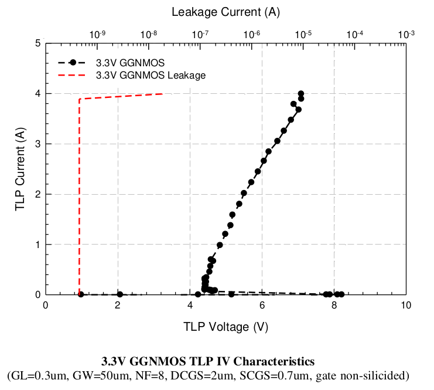

14.5.1 ESD Performance from 3.3V NMOS transistor
================================================

ESD Performance from 3.3V NMOS transistor is summarized in following table. The TLP data for 3.3V grounded gate NMOS without ESD implant is showed in below.

.. csv-table::
    :file: tables_clear/60_ESD_Performance_174.csv
    :widths: 400, 300
    :align: center

