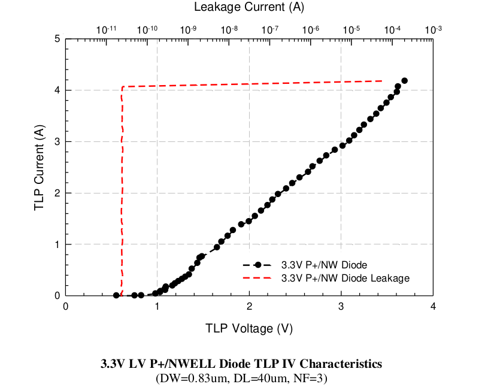

14.5.3 ESD Performance from 3.3V LV P+/NWELL diode
==================================================

ESD Performance from 3.3V LV P+/NWELL diode is summarized in following table. The TLP data for 3.3V LV P+/NWELL diode is showed in below.

.. csv-table::
    :file: tables_clear/62_ESD3_Performance_176.csv
    :widths: 400, 300
    :align: center

