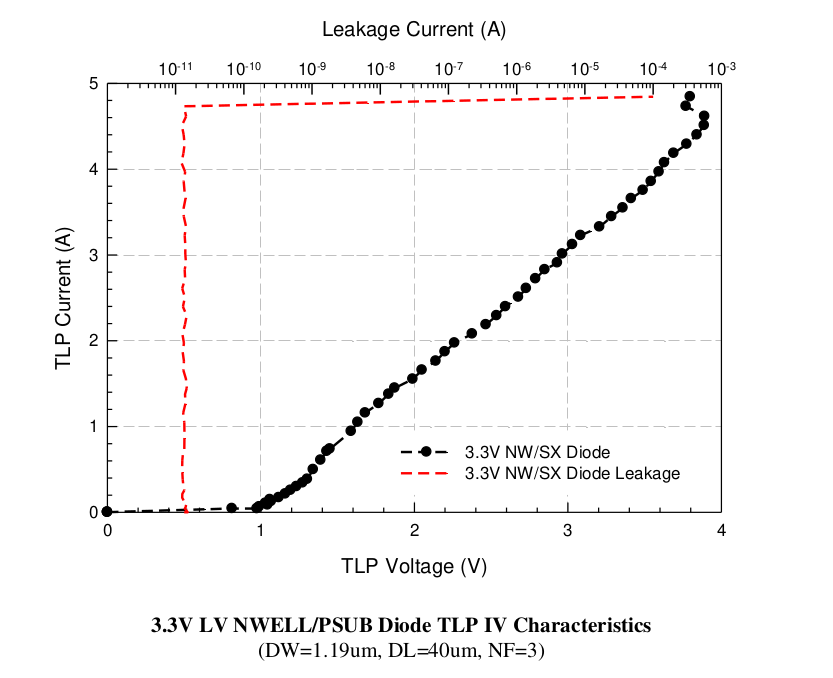

14.5.4. ESD Performance from 3.3V LV NWELL/PSUB diode
=========================================================

ESD Performance from 3.3V LV NWELL/PSUB diode is summarized in following table. The TLP data for 3.3V LV NWELL/PSUB diode is showed in below.

.. csv-table::
    :file: tables_clear/63_ESD4_Performance_177.csv
    :widths: 400, 300
    :align: center

