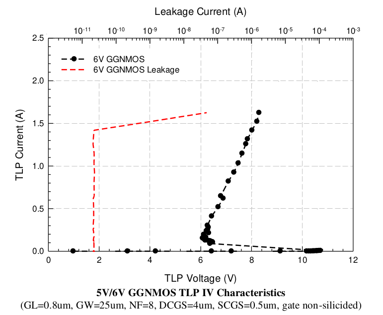

14.5.5 ESD Performance from 5V/6V NMOS transistor
===================================================

ESD Performance from 5V/6V NMOS transistor is summarized in following table. The TLP data for 5V/6V grounded gate NMOS without ESD implant is showed in below.

.. csv-table::
    :file: tables_clear/64_ESD5_Performance_178.csv
    :widths: 400, 300
    :align: center

