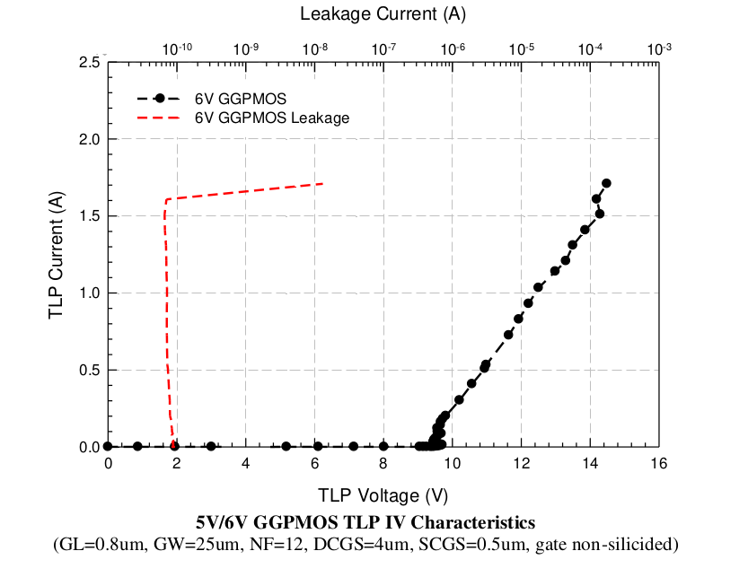

14.5.6 ESD Performance from 5V/6V PMOS transistor
=================================================

ESD Performance from 5V/6V PMOS transistor is summarized in following table. The TLP data for 5V/6V grounded gate PMOS without ESD implant is showed in below.

.. csv-table::
    :file: tables_clear/65_ESD6_Performance_179.csv
    :widths: 400, 300
    :align: center

