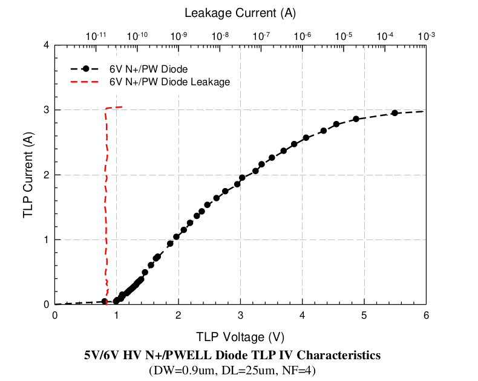

14.5.7 ESD Performance from 5V/6V HV N+/PWELL diode
===================================================

ESD Performance from 5V/6V HV N+/PWELL diode is summarized in following table. The TLP data for 5V/6V HV N+/PWELL diode is showed in below.

.. csv-table::
    :file: tables_clear/66_ESD7_Performance_180.csv
    :widths: 400, 300
    :align: center

