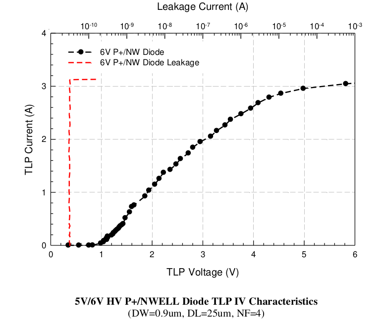

14.5.8 ESD Performance from 5V/6V HV P+/NWELL diode
=====================================================

ESD Performance from 5V/6V HV P+/NWELL diode is summarized in following table. The TLP data for 5V/6V HV P+/NWELL diode is showed in below.

.. csv-table::
    :file: tables_clear/67_ESD8_Performance_181.csv
    :widths: 400, 300
    :align: center

